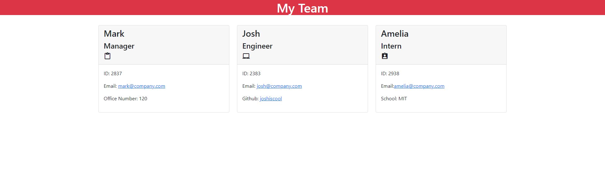

# Team Profile Generator


  
## Description

A Node.js command-line application that takes in information about employees on a software engineering team and generates an HTML webpage that displays summaries for each person.



## Table of Contents

- [Installation](#installation)
- [Usage](#usage)
- [License](#license)
- [Contributing](#contributing)
- [Tests](#tests)
- [Questions](#questions)

## Installation

Clone the code from this repository to your local machine. Node.js is required to run this application.
- Install Inquirer module.
- Install File System (fs) module.

## Usage

```
- node index.js
- enter prompted information 
- check /dist for written HTML file
```

## License
    
Licensed under the [MIT License](https://spdx.org/licenses/MIT.html)

## Contributing

No contributions will be accpeted at this time.

## Tests

No further tests have been planned for this application at this time.

## Questions

Have questions? Reach me at the following sources!

* GitHub: [realnifty](https://github.com/realnifty)
* E-mail: lovecore@pm.me
